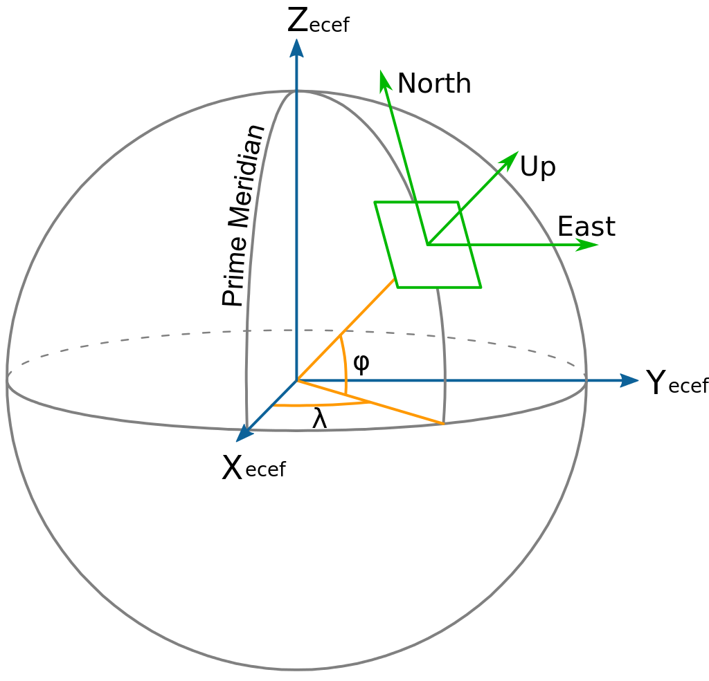
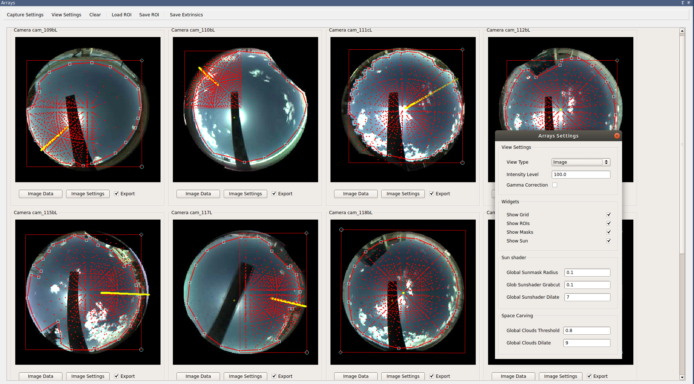
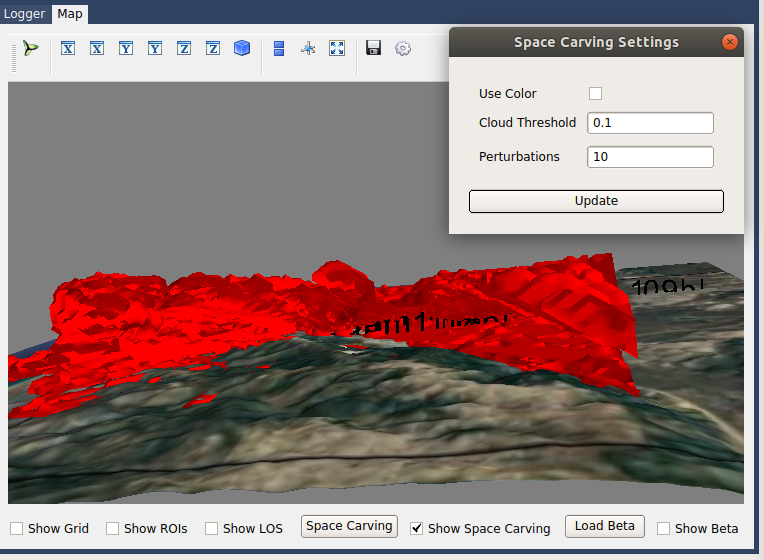
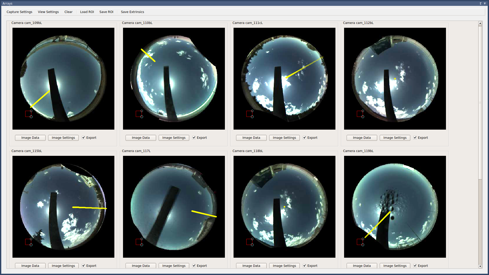
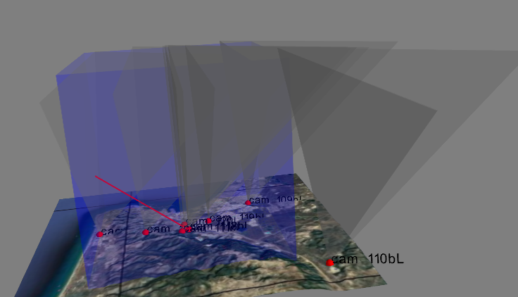

# Image pipeline of *cameranetwork* 
This document describes the operations that are being done on images, 
and prepares the inputs required to run 3D reconstructions. 

## Prepossessing on board:
1. [Image capturing]('CameraNetwork/controller.py#L1578-1649'): multi shot averaging (for SNR enhancement), 
and for several exposure times (for HDR).
2. [Camera prepossessing]('CameraNetwork/controller.py#L1388-1527'): dark image subtraction, normalization (according to fisheye model), 
HDR calculation, and vignetting correction. 
    >Note: This function is called from [seekImageArray()]('CameraNetwork/controller.py#1272), and  [handle_array()]('CameraNetwork/controller.py#1221), 
that means that the saved images are before prepossessing, and one needs to call one of these in order to apply the prepossessing. 

## Prepossessing using GUI:
### 1. Masking & Space carving:
1. 2D *grabcut*: 
    
    - Choose under `Arrays` tab: `view settings` -> `space carving`. 

    - It creates a cloud mask based on dilation operation (Applied by a maximum filter). 

    - This operation is done in [ArrayModel._update_cloud_weights()](https://github.com/Addalin/cameranetwork/blob/f26cdd785dabfc6f8d217a0e9b16fa1870d26fa9/CameraNetwork/gui/main.py#L954)
2. 2D *sunshader*: 

    - choose under `Arrays` tab: `view settings` -> `sun shader`.   
    
    - It creates a sunshader mask based on *erosion* operation Since the mask is an inversion of the sunshader.) 

    - This is done in  [calcSunshaderMask()](https://github.com/Addalin/cameranetwork/blob/945e9e8519216d2bd8a75afa6e650367d8f7ee88/CameraNetwork/image_utils.py#L544).

3. 2D *ROI*:  

    - Choose under `Arrays` tab: `view settings` -> `Widgets` -> `show ROI`. 
    
    - This is a rectangular mask that determines what is the relevant area in the image that observes on the volume of interest. 
Currently, it is manually set. 

    - Choosing the option `Show Grid` presents the inspected volume (on the map shown as a blue cube) and it's voxel as grid projection 
(red scatter plot on each of the images), thus helps to set the ROI. 

    - The ROI can be uploaded from earlier sessions or saved (as .pkl file). 

4. 2D and 3D space carving: 
    - This operation is done in [Map3dModel.do_space_carving()](https://github.com/Addalin/cameranetwork/blob/19efb5bbf0350d6cbd3b6d01efaaa08347b15327/CameraNetwork/gui/main.py#L317)

Finally, [exportData()](https://github.com/Addalin/cameranetwork/blob/02f1e7f8c0f7d88b9e603daf7ddb0b6c55a8f237/CameraNetwork/gui/main.py#L1807-L1895) 
saves space_carve.pkl and call export to shdom.

[exportToShdom()](https://github.com/Addalin/cameranetwork/blob/c85e88bd0cf35bbd095744e2b2dc92600eb6e0c5/CameraNetwork/export.py#L51-L168): 
includes final masking of ROI and sunshader, and it saves the sun mask separately.
##### Questions regarding space carving:  
3. what is the difference between a mask that is saved to the space_carve.pkl?

#### Notes and questions regarding ROI:
1. In the class [image_analysis](https://github.com/Addalin/cameranetwork/blob/994af1ad6f7d465ec5bff38d3ca22e338225e9fe/CameraNetwork/gui/image_analysis.py#L129-L228), 
there exist the following objects:
*"ROI"* object is based on [a generic region-of-interest widget](http://www.pyqtgraph.org/documentation/graphicsItems/roi.html#pyqtgraph.ROI). 
The projected grid, *"grid_scatter"* is of [ScatterPlotItem](http://www.pyqtgraph.org/documentation/graphicsItems/scatterplotitem.html#pyqtgraph.ScatterPlotItem).
The *"mask_ROI"* is of [pg.PolyLineROI](http://www.pyqtgraph.org/documentation/graphicsItems/roi.html#pyqtgraph.PolyLineROI).
 What is the relation between ROI and ROI_mask? 
Which of the objects is being used in the final mask calculation of the image?

2. When [drawing the camera](https://github.com/Addalin/cameranetwork/blob/c69dda2adc041dc2dc98660b34e57769213f23a9/CameraNetwork/gui/main.py#L266-L315) there is an option to add the drow of
 ["roi_mesh"](https://github.com/Addalin/cameranetwork/blob/c69dda2adc041dc2dc98660b34e57769213f23a9/CameraNetwork/gui/main.py#L301-L310), the 3D projection of cameras' ROIs. 
 Currently, it is not visually clear and it seems that these objects are not perfectly calculated on the 2D ROIs. 
 It requires a farther investigation. E.g. how and when the 3D mesh is calculated?  
 Also, maybe we need to update the mesh visualization of ROI in 3D.  

3. ***TODO*** Find a way to calculate the ROI automatically based on the grid projection?  
### 2. Extrinsic calibration
This process is done according to sun position and sunshader. 
The process should apply for a sunny day having clear sky, and requires two steps:
1. [handle_sunshader_scan()](https://github.com/Addalin/cameranetwork/blob/4f6a0b01111725799e6796dbf206f624a99c231b/CameraNetwork/server.py#L1066-L1088) 

    - calculates sun position on the image plane (`measured_positions`), sun shader angle, the color value, and then save all to `sun_positions.csv`(under sun_positions folder). 

    - This process is done every ~6 min.
2. [handle_extrinsic()](https://github.com/Addalin/cameranetwork/blob/3552f2453f3d42942ae6f90c2245b9ccb7c3dbce/CameraNetwork/controller.py#L965-L1070) - 

    - loads `measured_positions` from `sun_positions.csv` 
and calculates the `measured_directions` according to the fisheye model (undistortion)
on a unit sphere. 

     - The fisheye model is pre-determined during [intrinsic calibration process](https://github.com/Addalin/cameranetwork/blob/3552f2453f3d42942ae6f90c2245b9ccb7c3dbce/CameraNetwork/controller.py#L888-L901).
     
    - Using the measurements times in `sun_positions.csv` and *ephem*, the function calculates sun directions `calculated_directions`. 
And then estimates camera orientation, by doing fit of `measured_directions` to `calculated_directions`. 

    - This process gives as well the rotation matrix *R* (camera-to-world transform ).

To apply the extrinsic calibration from the GUI: 

  - `severs` ->
 `choose camera` -> `Exrinsic` tab -> 
 `extrinsic calibrate` 
  - Also saves the extrinsic_data.npy in camera folder.

To save all cameras extrinsic calibration: 

  - `Arrays` --> `Save Extrinsic`
 
  - Saves in a specific day of captured_images folder.

Graphical Result:

- See a mathematical description, see p.49-50 in Amit's thesis, section: "Self-Calibration in a Camera Network".

### 3. Radiometric calibration:
To perform radiometric calibration with a sunphotometer, 
the camera should be close to the sunphotometer, and the measurements should be done in a clear sky day. 

To get the sunphotometer measurements: 

1. Download files from NASA's [AERONET site](https://aeronet.gsfc.nasa.gov/cgi-bin/webtool_inv_v3?stage=3&region=Middle_East&state=Israel&site=Technion_Haifa_IL&place_code=10&if_polarized=0).

    - All the current files can be found under `.../data/aeronet`. 
  
    - Some manipulation, such as deleting first rows, might be needed for new data. 

    - The meaning of numbers and measurements can be found [here](https://aeronet.gsfc.nasa.gov/new_web/units.html). 

    - Specifically: irradiance sunphotometer units are .

2. The function [handle_radiometric()](https://github.com/Addalin/cameranetwork/blob/3552f2453f3d42942ae6f90c2245b9ccb7c3dbce/CameraNetwork/controller.py#L1095-L1178):

    - reads the sunphotometer measurements according to 3 channels at the requested day and hour. 
    
    - Then estimates the location of the pixel on the image plane corresponding to Almucantar measurement angles. 
    
    - Then the radiometric fit is estimated between sunphotometer measurements to camera samples. 

3. The radiometric results are saved to radiometric.pkl under the camera's folder.

For example:

[Radiometric](docs/source/images/radiometric_calibration.png)

##### Questions regarding radiometric calibration:  
1. What are the final conversion units?
2. What inputs/changes are required for a new experiment?

### 4. 3D grid and space curving:
The [geographic coordinate systems](https://en.wikipedia.org/wiki/Geographic_coordinate_system) that are used here are: 
1. The ECEF (earth-centered, earth-fixed frame) is the common 3D grid that is being used for moving the point-of-view (the observing camera) around the grid conveniently according to cameras' location (Latitude (\phi), longitude (\lambda),X_ecef,Y_ecef,Z_ecef). 
2. The NED (North East Down) grid (X,Y,Z) is used for visualization and reconstruction grid.

See their definitions in the project [here](https://github.com/Addalin/cameranetwork/blob/c69dda2adc041dc2dc98660b34e57769213f23a9/CameraNetwork/gui/main.py#L1393-L1420). 
image of the relation between both coordinates systems: 

 
There are several conversion processes that are being done: 

1. [ProjectGrid()](https://github.com/Addalin/cameranetwork/blob/fa7d2b2f29d5217cdc2b216ae55d147393e9db0d/CameraNetwork/image_utils.py#L615-L645) - Projecting the 3D grid of the interest volume, onto image plane. Which uses ecef2ned in [projectECEF()](https://github.com/Addalin/cameranetwork/blob/c69dda2adc041dc2dc98660b34e57769213f23a9/CameraNetwork/gui/main.py#L881-L933). 
The 3D NED grid is of size 12 X 12 X 10 [km^3], having 81 X 81 X 121 voxels, each voxel size is of 150 X 150 X 100 [m^3].
The 3D grid is projected to a 2D grid on the image plane, shown as red dots on image plane).
This is done when choosing: `View settings`-->`Widgets`--> `show grid`. 

This method is also being used when computing the [space carve](https://github.com/Addalin/cameranetwork/blob/fa7d2b2f29d5217cdc2b216ae55d147393e9db0d/CameraNetwork/image_utils.py#L738-L810) score per each view.
This is done when choosing in the map view `Space carving`--> `Update` --> `Show space carving`.

Another usage of this method is when applying [Update LOS](https://github.com/Addalin/cameranetwork/blob/c69dda2adc041dc2dc98660b34e57769213f23a9/CameraNetwork/gui/main.py#L620-L667). Ths function converts the  also uses 
LOS of a single image to the epipolar lines on all other images.

To change the line of sight, simply press inside any oen of the images. The others should updat automatically.

The change should also be visible in the map if `show LOS` has been enabled. 

The 3D grid and ROI can also be seen in the map.

2. The main process [do_space_carving()](https://github.com/Addalin/cameranetwork/blob/c69dda2adc041dc2dc98660b34e57769213f23a9/CameraNetwork/gui/main.py#L317-L337) of the 3D grid, calls visual hall calculation, using a process pool. 
[calc_visual_hull()](https://github.com/Addalin/cameranetwork/blob/2583c47e52d937ba70c5d7f9293d970c0fcba428/CameraNetwork/image_utils.py#L655-L739) runs space carve per each view separately, and collects their results.   

(// TODOL add snapshot and explanation here.). 

[space_carve_view()](https://github.com/Addalin/cameranetwork/blob/fa7d2b2f29d5217cdc2b216ae55d147393e9db0d/CameraNetwork/image_utils.py#L739-L810), projects the the 3D grid onto the corresponding image plane. 
This process is done according to the number of perturbations chosen by the user. The final `grid_score` is the mean value throughout the perturbations, for the voxels that are seen from this view. 

// TODOL add snapshot and explanation here.). 

The `grid score` is based on the `cloud_weights`. This is done at [_update_cloud_weights()](https://github.com/Addalin/cameranetwork/blob/c69dda2adc041dc2dc98660b34e57769213f23a9/CameraNetwork/gui/main.py#L936-L985), on the 2D image plane (see section *Computation of cloud scores maps*, p.23, Amit's Aides thesis).

Following that, [calc_visual_hull()](https://github.com/Addalin/cameranetwork/blob/2583c47e52d937ba70c5d7f9293d970c0fcba428/CameraNetwork/image_utils.py#L655-L739), collects scores from all servers/ subprocesses. 

### TODO: Other issues to cover regarding image pipeline: 
1. Calculate pixels phase function.?
2. Intrinsic calibration. 
