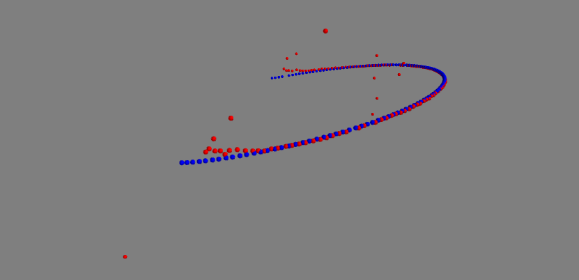
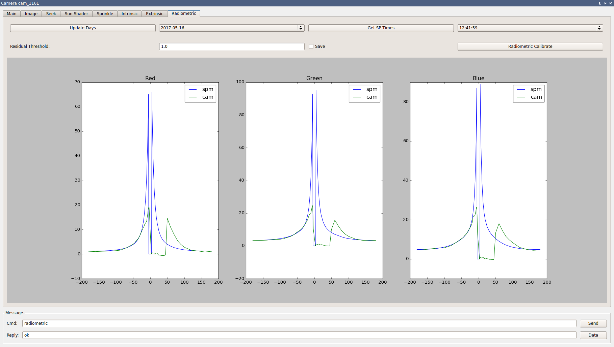

# Image pipeline of *cameranetwork* 
This document describes the operations that are being done on images, 
and prepares the inputs required to run 3D reconstructions. 

## Prepossessing on board:
1. [Image capturing]('CameraNetwork/controller.py#L1578-1649'): multi shot averaging (for SNR enhancement), 
and for several exposure times (for HDR).
2. [Camera prepossessing]('CameraNetwork/controller.py#L1388-1527'): dark image subtraction, normalization (according to fisheye model), 
HDR calculation, and vignetting correction. 
    >Note: This function is called from [seekImageArray()]('CameraNetwork/controller.py#1272), and  [handle_array()]('CameraNetwork/controller.py#1221), 
that means that the saved images are before prepossessing, and one needs to call one of these in order to apply the prepossessing. 

## Prepossessing using GUI:
### 1. Masking & Space carving:
1. 2D *grabcut*: 
    
    - Choose under `Arrays` tab: `view settings` -> `space carving`. 

    - It creates a cloud mask based on dilation operation (Applied by a maximum filter). 

    - This operation is done in [ArrayModel._update_cloud_weights()](https://github.com/Addalin/cameranetwork/blob/f26cdd785dabfc6f8d217a0e9b16fa1870d26fa9/CameraNetwork/gui/main.py#L954)
2. 2D *sunshader*: 

    - choose under `Arrays` tab: `view settings` -> `sun shader`.   
    
    - It creates a sunshader mask based on *erosion* operation Since the mask is an inversion of the sunshader.) 

    - This is done in  [calcSunshaderMask()](https://github.com/Addalin/cameranetwork/blob/945e9e8519216d2bd8a75afa6e650367d8f7ee88/CameraNetwork/image_utils.py#L544).

3. 2D *ROI*:  

    - Choose under `Arrays` tab: `view settings` -> `Widgets` -> `show ROI`. 
    
    - This is a rectangular mask that determines what is the relevant area in the image that observes on the volume of interest. 
Currently, it is manually set. 

    - Choosing the option `Show Grid` presents the inspected volume (on the map shown as a blue cube) and it's voxel as grid projection 
(red scatter plot on each of the images), thus helps to set the ROI. 

    - The ROI can be uploaded from earlier sessions or saved (as .pkl file). 

4. 2D and 3D space carving: 
    - This operation is done in [Map3dModel.do_space_carving()](https://github.com/Addalin/cameranetwork/blob/19efb5bbf0350d6cbd3b6d01efaaa08347b15327/CameraNetwork/gui/main.py#L317)

Finally, [exportData()](https://github.com/Addalin/cameranetwork/blob/02f1e7f8c0f7d88b9e603daf7ddb0b6c55a8f237/CameraNetwork/gui/main.py#L1807-L1895) 
saves space_carve.pkl and call export to shdom.

[exportToShdom()](https://github.com/Addalin/cameranetwork/blob/c85e88bd0cf35bbd095744e2b2dc92600eb6e0c5/CameraNetwork/export.py#L51-L168): 
includes final masking of ROI and sunshader, and it saves the sun mask separately.
##### Questions regarding space carving:  
3. what is the difference between a mask that is saved to the space_carve.pkl?

#### Notes and questions regarding ROI:
1. In the class [image_analysis](https://github.com/Addalin/cameranetwork/blob/994af1ad6f7d465ec5bff38d3ca22e338225e9fe/CameraNetwork/gui/image_analysis.py#L129-L228), 
there exist the following objects:
*"ROI"* object is based on [a generic region-of-interest widget](http://www.pyqtgraph.org/documentation/graphicsItems/roi.html#pyqtgraph.ROI). 
The projected grid, *"grid_scatter"* is of [ScatterPlotItem](http://www.pyqtgraph.org/documentation/graphicsItems/scatterplotitem.html#pyqtgraph.ScatterPlotItem).
The *"mask_ROI"* is of [pg.PolyLineROI](http://www.pyqtgraph.org/documentation/graphicsItems/roi.html#pyqtgraph.PolyLineROI).
 What is the relation between ROI and ROI_mask? 
Which of the objects is being used in the final mask calculation of the image?

2. When [drawing the camera](https://github.com/Addalin/cameranetwork/blob/c69dda2adc041dc2dc98660b34e57769213f23a9/CameraNetwork/gui/main.py#L266-L315) there is an option to add the drow of
 ["roi_mesh"](https://github.com/Addalin/cameranetwork/blob/c69dda2adc041dc2dc98660b34e57769213f23a9/CameraNetwork/gui/main.py#L301-L310), the 3D projection of cameras' ROIs. 
 Currently, it is not visually clear and it seems that these objects are not perfectly calculated on the 2D ROIs. 
 It requires a farther investigation. E.g. how and when the 3D mesh is calculated?  
 Also, maybe we need to update the mesh visualization of ROI in 3D.  

3. ***TODO*** Find a way to calculate the ROI automatically based on the grid projection?  
### 2. Extrinsic calibration
This proccess is done according to sun position and sunshader. 
The process should apply for a sunny day having clear sky, and requires two steps:
1. [handle_sunshader_scan()](https://github.com/Addalin/cameranetwork/blob/4f6a0b01111725799e6796dbf206f624a99c231b/CameraNetwork/server.py#L1066-L1088) 

    - calculates sun position on the image plane (`measured_positions`), sun shader angle, the color value, and then save all to `sun_positions.csv`(under sun_positions folder). 

    - This process is done every ~6 min.
2. [handle_extrinsic()](https://github.com/Addalin/cameranetwork/blob/3552f2453f3d42942ae6f90c2245b9ccb7c3dbce/CameraNetwork/controller.py#L965-L1070) - 

    - loads `measured_positions` from `sun_positions.csv` 
and calculates the `measured_directions` according to the fisheye model (undistortion)
on a unit sphere. 

     - The fisheye model is pre-determined during [intrinsic calibration process](https://github.com/Addalin/cameranetwork/blob/3552f2453f3d42942ae6f90c2245b9ccb7c3dbce/CameraNetwork/controller.py#L888-L901).
     
    - Using the measurements times in `sun_positions.csv` and *ephem*, the function calculates sun directions `calculated_directions`. 
And then estimates camera orientation, by doing fit of `measured_directions` to `calculated_directions`. 

    - This process gives as well the rotation matrix *R* (camera-to-world transform ).

To apply the extrinsic calibration from the GUI: 

  - `severs` ->
 `choose camera` -> `Exrinsic` tab -> 
 `extrinsic calibrate` 
  - Also saves the extrinsic_data.npy in camera folder.

To save all cameras extrinsic calibration: 

  - `Arrays` --> `Save Extrinsic`
 
  - Saves in a specific day of captured_images folder.

Graphical Result:

### 3. Radiometric calibration:
To perform radiometric calibration with a sunphotometer, 
the camera should be close to the sunphotometer, and the measurements should be done in a clear sky day. 

To get the sunphotometer measurements: 
1. download files from NASA's [AERONET site](https://aeronet.gsfc.nasa.gov/cgi-bin/webtool_inv_v3?stage=3&region=Middle_East&state=Israel&site=Technion_Haifa_IL&place_code=10&if_polarized=0).

    - All the current files can be found under `.../data/aeronet`. 
  
    - Some manipulation, such as deleting first rows, might be needed for new data. 

    - The meaning of numbers and measurements can be found [here](https://aeronet.gsfc.nasa.gov/new_web/units.html). 
        - Specifically: irradiance sunphotometer units are [uW/cm^2/sr/nm].

2. The function [handle_radiometric()](https://github.com/Addalin/cameranetwork/blob/3552f2453f3d42942ae6f90c2245b9ccb7c3dbce/CameraNetwork/controller.py#L1095-L1178):

    - reads the sunphotometer measurements according to 3 channels at the requested day and hour. 
    
    - Then estimates the location of the pixel on the image plane corresponding to Almucantar measurement angles. 
    
    - Then the radiometric fit is estimated between sunphotometer measurements to camera samples. 

3. The radiometric results are saved to radiometric.pkl under the camera's folder.

For example:

##### Questions regarding radiometric calibration:  
1. What are the final conversion units?
2. What inputs/changes are required for a new experiment?

### TODO: Other issues to cover regarding image pipeline: 
1. Space curving - the transition from 2d and 3d.
2. Calculate pixels phase function.?
3. Intrinsic calibration. 
